# Nokkela Voice Assistant (NVA)

Nokkela Voice Assistant – or NVA for short – is a local web service that enables interactive communication in naturally comprehensible language.
It is based on advanced OpenAI technology and incorporates three essential components: Speech-to-Text (STT), Natural Language Processing, Large Language Model (LLM) processing, and Text-to-Speech (TTS).
With a simple web interface (Start/Stop button), users can record their spoken language and have it converted into a processed answer by the system.
In version 1.0, the communication is handled exclusively via the OpenAI infrastructure, which requires a valid OpenAI API key.

## Detailed Functional Principle

* Speech Capture: The user starts recording their voice via the web interface.
* Conversion to Text: The captured audio recording is forwarded to the OpenAI Speech-to-Text API, which converts the speech input into text.
* Text Processing: The text is then transmitted to the OpenAI LLM API for content processing (e.g., dialogue management or translations).
* Conversion back to Audio: The generated result is sent to the OpenAI Text-to-Speech API, so that the final audio clip is produced and played back to the user.

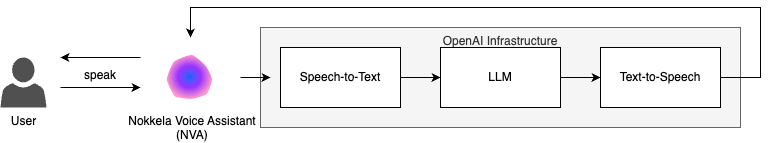

The NVA provides two main modes:

* Assistant Mode: Used for interactive conversation with ChatGPT.
* Translator Mode: Allows the translation of spoken language into other languages.

Additionally, modern technologies such as Docker are employed to make the installation and operation of the system technically user-friendly and reproducible.
A youth protection-friendly system prompt ensures engaging and secure interaction.
The use of the “SnakeOil” certificate also enables encrypted communication at all times, which is particularly advantageous in shared networks (e.g., in workshops or training sessions).

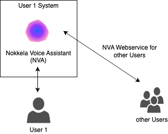

## Possible Target Groups and Use Cases

* Educational Institutions and Training Providers
* * Area of Application: Language training, interactive learning environments, second language instruction
* Benefits:
* * Simulation of realistic conversation scenarios
* * Support for language learning through immediate translations
* * Safe training tool thanks to encryption and local operation
* * Example Problem: Teachers may have difficulties simulating authentic conversation partners. In this case, the NVA offers a reliable and interactive alternative.

* Companies and Call Centers
* * Area of Application: Customer service optimization, automated telephone assistance, internal communication support
* Benefits:
* * Automation of routine inquiries
* * Improved response times through direct voice interaction
* * Ability to offer multilingual support
* * Example Problem: Call centers often need multilingual representatives. With the Translator Mode, language barriers can be quickly overcome.

* Developers and System Integrators
* * Area of Application: Prototyping, integration into existing systems, testing of conversational AI
* Benefits:
* * Easy reproducibility thanks to Docker
* * Fast integration as a local web service into one’s own applications
* * Access to cutting-edge OpenAI technology without extensive development effort
* * Example Problem: Lack of resources for developing custom voice assistants. The NVA provides a fast entry point and scalability.

* Research Institutions and Start-ups
* * Area of Application: Experimental applications, user research, pilot projects in the field of AI and speech processing
* Benefits:
* * Use of OpenAI APIs to test new scenarios
* * Easy access to state-of-the-art technologies
* * Possibility to evaluate user interactions and dialogue flows
* * Example Problem: Research projects need flexible tools to evaluate speech interactions. The NVA offers a scalable and adaptable framework.

* Public Institutions and Cultural Projects
* * Area of Application: Information kiosks, digital assistants in museums or libraries, citizen services
* Benefits:
* * Barrier-free and intuitive interaction via voice
* * Automatic translation functions for multilingual societies
* * Creation of a modern, digital access to information
* * Example Problem: Institutions also want to enable technology-averse users to access complex information. With its ease of use, the NVA can provide a solution here.

## Summary

The NVA demonstrates, as a local Docker-supported web service, a robust solution for integrating modern voice assistant technologies in a variety of environments.
The clear division into Assistant and Translator modes enables flexible usage, while the use of OpenAI APIs guarantees project-specific performance and scalability.

NVA offers:
* A versatile platform that can be adapted to different industries and requirements.
* An innovative concept that links conventional voice assistant solutions with state-of-the-art AI technology.
* Minimal conversion costs thanks to containerized deployment and easily integrable interfaces.

This solution thus opens up new opportunities for both established companies as well as innovative start-ups and educational institutions to leverage the benefits of artificial intelligence and modern voice technologies in their respective markets.
Sharing is Caring - by using a SnakeOil certificate, a secure, low-overhead, and versatile approach (e.g., in workshops) is ensured, with all open-source components available under the GPLv3.
With the NVA, every target group obtains a powerful tool that not only enables interaction with complex language models but also creates cross-industry added value by solving everyday challenges in communication and information exchange.

## Security

The NVA continuously provides the web service with SSL/TLS encryption – both for end users and for communication with the OpenAI infrastructure. Additionally, we recommend using supplementary load balancers, such as HAproxy or Traefik, as well as connecting Ollama servers via SSL/TLS connections to further optimize the security and performance of the solution.

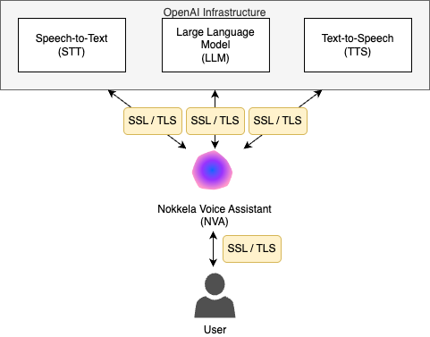

# Roadmap

- [ ] Full Support for Mobile Devices (Apple iOS / Android) - workarounds are necessary due to various system limitations
- [ ] Supports fragmented object processing, resulting in shorter response times and a more natural flow of speech without having to wait for the complete TTS processing
- [ ] Support for OpenAI Realtime API
- [x] Version 2.5.1 - Model Recommendation: [Artificial Analysis Intelligence Index](https://github.com/NokkelaAI/artificial-analysis-intelligence-index/)
- [x] Version 2.5 - Add SystemPrompt "Consultant"
- [x] Version 2.4.4 - Add Security fixes for Python Base Image & PyPi Packages
- [x] Version 2.4.3 - Support for (Local) Ollama "Gemma3-4B" Model (LLM)
- [x] Version 2.4.2 - Support for (Remote) Ollama "Gemma3-27B" Model (LLM)
- [x] Version 2.4.1 - Support for (Remote) Ollama "DeepSeek-R1-0528-Qwen3-8B" Reasoning Model (LLM)
- [x] Version 2.4 - Add SystemPrompt "StoryTeller"
- [x] Support for (Remote) Ollama "DeepSeek-R1-671B" Reasoning Model (LLM)
- [x] Version 2.3 - Add SystemPrompt Images
- [x] Support for (Remote) Ollama "Qwen3-235B-A22B" MoE Model (LLM)
- [x] Version 2.2 - Avoid TTS Error "string_too_long" (ctx max_length 4096)
- [x] Version 2.1 - Add SystemPrompts "Instructor", "MediDoc", "Cleric"
- [x] Add: Press ESC to Cancel all ongoing actions
- [x] Version 2.0 - Partial Support for Contextual Communication (+ Reset Session)
- [x] Support for (Remote) Ollama "Llama4-Scout-109B" MoE Model (LLM)
- [x] Version 1.9 - Partial Support for Apple iPad using Chrome (as a client device)
- [x] Ignore emojis in models during speech output
- [x] Support for (Remote) Ollama "Qwen3-30B-A3B" MoE Model (LLM)
- [x] Support for (Remote) Ollama "Qwen3-32B" Reasoning Model (LLM)
- [x] Offline d3.v7.min.js
- [x] Add: Press Enter (without Shift) to send the text
- [x] Add Warning for Insecure HTTP Custom Server URLs
- [x] Add Docker ENV Support for TTS_VOICE
- [x] Version 1.8 - Initial Support for "Full Selfhosted Setup" (OpenAI is not used at all)
- [x] Version 1.7 - Initial Support for external (Whisper)STT Speech-to-Text API Server (Selfhosted)
- [x] Add Docker ENV Support for WEB_AUTH_USER and WEB_AUTH_PW
- [x] Version 1.6 - Support for "Custom Ollama Models" in Voice Mode
- [x] Version 1.5 - Support for the spacebar has been added, allowing for quick voice interaction
- [x] Version 1.4 - Debug Text logging is shortened for privacy reasons
- [x] Version 1.3 - Added "Silent Input Text" function, allowing for interaction in quiet spaces where speech is received only via headphones
- [x] Version 1.2 - Initial Support for external (X)TTS Text-to-Speech API Server (Selfhosted)
- [x] Support for (Local) Ollama "Cogito-3B" Model (LLM only) - OpenAI for STT & TTS
- [x] Support for (Local) Ollama "Cogito-8B" Model (LLM only) - OpenAI for STT & TTS
- [x] Support for (Remote) Ollama "Cogito-14B" Model (LLM only) - OpenAI for STT & TTS
- [x] Support for (Remote) Ollama "Cogito-32B" Model (LLM only) - OpenAI for STT & TTS
- [x] Support for (Remote) Ollama "Cogito-70B" Model (LLM only) - OpenAI for STT & TTS
- [x] Support for (Remote) Ollama "QwQ-32B" Reasoning Model (LLM only) - OpenAI for STT & TTS
- [x] Support for (Remote) Ollama "Llama3.3-70B" Model (LLM only) - OpenAI for STT & TTS
- [x] Version 1.1 - Initial Support for external Ollama API Server (LLM only)
- [x] Offers SSL / TLS connections out of the box
- [x] For debugging purposes or for future analyses, log files are automatically stored under /app/data
- [x] Supports language translation for two different speakers
- [x] System prompt takes youth protection into account
- [x] Initial Version 1.0 (thoroughly tested)
- [x] Uses OpenAI infrastructure for speech-to-text (STT), large language model (LLM), and text-to-speech (TTS)
- [x] Uses Docker for a reproducible and generic system platform
- [x] Simple Python and D3.js code with good documentation
- [x] Developed as Open Source under GPLv3

# Supported languages (transcriptions)

* https://platform.openai.com/docs/guides/speech-to-text#supported-languages

Afrikaans, Arabic, Armenian, Azerbaijani, Belarusian, Bosnian, Bulgarian, Catalan, Chinese, Croatian, Czech, Danish, Dutch, English, Estonian, Finnish, French, Galician, German, Greek, Hebrew, Hindi, Hungarian, Icelandic, Indonesian, Italian, Japanese, Kannada, Kazakh, Korean, Latvian, Lithuanian, Macedonian, Malay, Marathi, Maori, Nepali, Norwegian, Persian, Polish, Portuguese, Romanian, Russian, Serbian, Slovak, Slovenian, Spanish, Swahili, Swedish, Tagalog, Tamil, Thai, Turkish, Ukrainian, Urdu, Vietnamese, and Welsh.

While the underlying model was trained on 98 languages, we only list the languages that exceeded <50% word error rate (WER) which is an industry standard benchmark for speech to text model accuracy. The model will return results for languages not listed above but the quality will be low.

# Webinterface (Version 2.4) "Assistant"

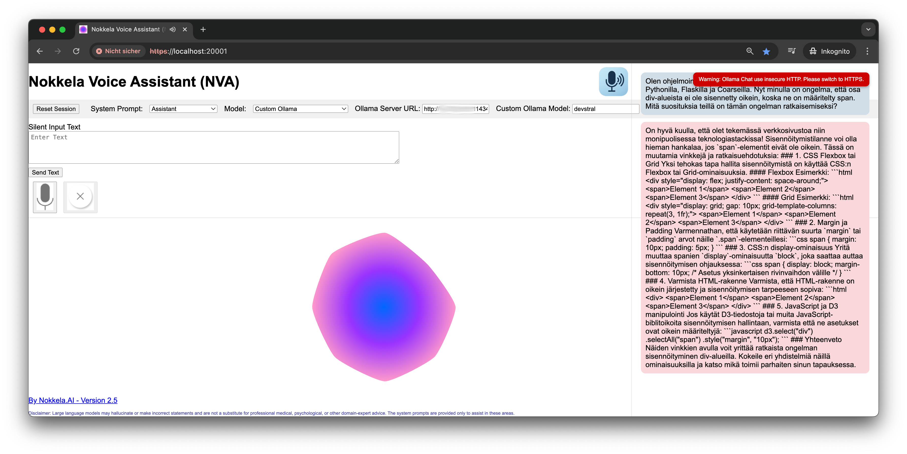

# Webinterface (Version 2.4.4) "Translator"

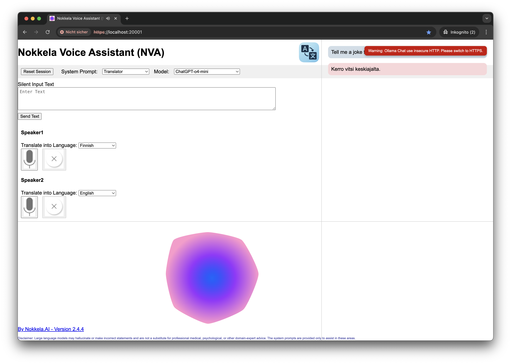

# Webinterface (Version 2.5) "StoryTeller"

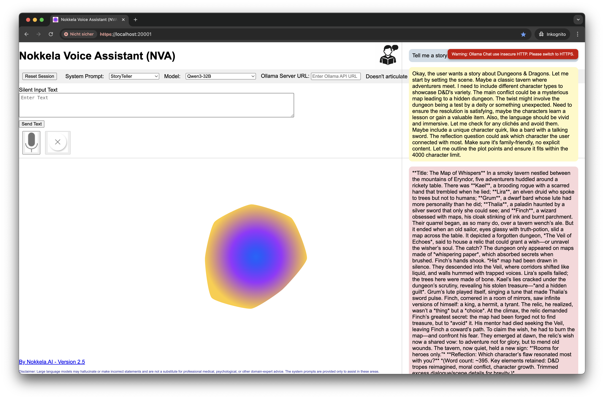

# Requirements

* Linux, Mac or Windows with Docker
* Google Chrome Browser

# Get Started (pull and run)

1-4. Get [OpenAI API Key](https://platform.openai.com/account/api-keys);

2-4. Docker - Pull the Image

```
docker pull nokkela/nokkela-voice-assistant:latest
```

3-4. Docker - Run

```shell
docker run \
       -d \
       -p 20001:20001 \
       -e OPENAI_KEY="YOUR-API-KEY" \
       -e WEB_AUTH_USER="nva" \
       -e WEB_AUTH_PW="nva" \
       nokkela-voice-assistant
```

4-4. Enjoy

# Get Started (build and run)

1-5. Get [OpenAI API Key](https://platform.openai.com/account/api-keys);

2-5. Clone the Repository

```
git clone https://github.com/NokkelaAI/nokkela-voice-assistant.git
```

3-5. Insert your OpenAI API Key into the "docker_build_and_run" script

* Linux

```
sed -i 's/YOUR-API-KEY/sk-XXXXXXXXX/g' docker_build_and_run.sh
```

* MacOS

```
sed -i '.bak' 's/YOUR-API-KEY/sk-XXXXXXXXX/g' docker_build_and_run.sh
```

4-5. Run the script

```
./docker_build_and_run.sh
```

5-5. Enjoy

# Deployment

## Docker

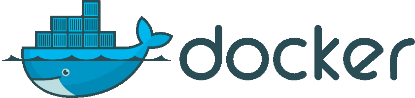

For debugging purposes or for future analyses, log files are automatically stored under /app/data.
To access this data, a Docker volume mapping can be used.

```shell
docker run \
       -d \
       -p 20001:20001 \
       -e OPENAI_KEY="YOUR-API-KEY" \
       -e WEB_AUTH_USER="nva" \
       -e WEB_AUTH_PW="nva" \
       -e OLLAMA_CHAT_URL="http://YOUR-SERVER-IP:11434/v1/chat/completions" \
       -v /data/nva:/app/data \
       nokkela-voice-assistant
```

## Log Files

```
appuser@4cfe3eaa2f2f:/app/data$ cat voice.log

2025-04-07 19:05:59,526 - INFO - Audio received and processed in memory
2025-04-07 19:06:01,228 - INFO - User: Hello, nice to meet you...
2025-04-07 19:06:06,146 - INFO - Bot: Hello! Nice to meet you too. How...
2025-04-07 19:06:07,860 - INFO - TTS audio generated for text: Hello! Nice to meet you too. H...
appuser@4cfe3eaa2f2f:/app/data$
```

## (Remote) (Whisper)STT "Speech-to-Text" (Selfhosted)

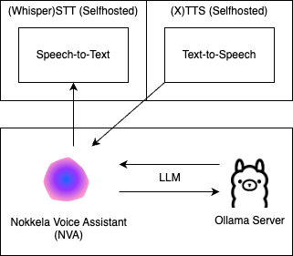

* Server with NVIDIA GPU | VM with (v)GPU Passthrough
* * Requirement:
* * * NVIDIA T4 (16 GB)
* * Recommendation:
* * * NVIDIA L4 (24 GB)

### (Whisper)STT Service: speaches.ai

```shell
docker run \
       --detach \
       --publish 8000:8000 \
       --name speaches \
       --volume /opt/hf-hub-cache:/home/ubuntu/.cache/huggingface/hub \
       --gpus=all \
       -e WHISPER__TTL=-1 \
       ghcr.io/speaches-ai/speaches:latest-cuda
```

### Python (Dummy) Container for downloading the (STT) model

* https://speaches.ai/installation/
* https://speaches.ai/usage/speech-to-text/

```shell
docker run -it python:3.12 bash

apt-get update
apt-get install -y jq
pip install uv

git clone https://github.com/speaches-ai/speaches.git
cd speaches
uv venv
source .venv/bin/activate
uv sync --all-extras

export SPEACHES_BASE_URL="http://YOUR-SERVER-IP:8000"

uvx speaches-cli registry ls --task automatic-speech-recognition | jq '.data' > DATA
grep "whisper-large-v3" DATA
uvx speaches-cli model download Systran/faster-whisper-large-v3
uvx speaches-cli model ls --task automatic-speech-recognition | jq '.data' | grep "faster-whisper-large-v3"

exit
```

### NVA: Docker ENVs

```shell
docker run \
       -d \
       -p 20001:20001 \
       -e OPENAI_KEY="YOUR-API-KEY" \
       -e OPENAI_TRANSCRIBE_URL="http://YOUR-SERVER-IP:8000/v1/audio/transcriptions" \
       -e OLLAMA_CHAT_URL="http://YOUR-SERVER-IP:11434/v1/chat/completions" \
       -e OPENAI_TTS_URL="Service 1 URL or Service 2 URL or Service 3 URL" \
       -e TTS_HD="YES" \
       -e TTS_VOICE="shimmer" \
       -v /data/nva:/app/data \
       nokkela-voice-assistant
```

# Artificial Analysis Intelligence Index (20250606)

## Select the model that best fits your needs!

### Source: https://github.com/NokkelaAI/artificial-analysis-intelligence-index/

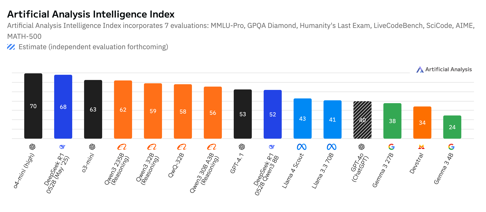

## (Remote) Ollama: "Llama3.3-70B" Model Support

### Example Service URL

```
http://YOUR-SERVER-IP:11434/v1/chat/completions
```

## (Remote) Ollama: "Qwen3-30B-A3B" MoE Model Support

### Example Service URL

```
http://YOUR-SERVER-IP:11434/v1/chat/completions
```

## (Remote) Ollama: "Qwen3-32B" Reasoning Model Support

### Example Service URL

```
http://YOUR-SERVER-IP:11434/v1/chat/completions
```

## (Remote) Ollama: "QwQ-32B" Reasoning Model Support

### Example Service URL

```
http://YOUR-SERVER-IP:11434/v1/chat/completions
```

## (Remote) Ollama Docker Service (Selfhosted)

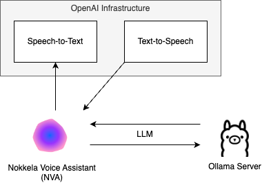

* Server with NVIDIA GPU | VM with (v)GPU Passthrough
* * Requirement:
* * * NVIDIA L4 (24 GB)
* * Recommendation:
* * * NVIDIA RTX A6000 (48 GB) - "Ampere" Architecture
* * * NVIDIA RTX 6000A (48 GB) - "Ada Lovelace" Architecture

### Server Service:

```
#!/bin/sh

export HUGGING_FACE_HUB_TOKEN=XXXXXXXXX
export CUDA_VISIBLE_DEVICES="0,1"
docker run \
       --gpus all \
       --runtime=nvidia \
       --shm-size=8g \
       -p 11434:11434 \
       --init \
       -v /opt/ollama:/root/.ollama \
       -e OLLAMA_KEEP_ALIVE=-1m \
       ollama/ollama

#       -v /etc/passwd:/etc/passwd:ro \
#       -v /etc/group:/etc/group:ro \
#       -u 1000:1000 \

# EOF
```

```
docker ps | egrep ollama
docker exec -it CONTAINERID bash
ollama run qwq
```

## (Remote) Ollama: "Cogito-70B" Model Support

* Server with NVIDIA GPU | VM with (v)GPU Passthrough
* * Requirement:
* * * NVIDIA RTX A6000 (48 GB) - "Ampere" Architecture
* * * NVIDIA RTX 6000A (48 GB) - "Ada Lovelace" Architecture
* * Recommendation:
* * * 2x NVIDIA RTX A6000 (48 GB) - "Ampere" Architecture
* * * 2x NVIDIA RTX 6000A (48 GB) - "Ada Lovelace" Architecture

```
docker ps | egrep ollama
docker exec -it CONTAINERID bash
ollama run cogito:70b
```

## (Local) Ollama: "Cogito-8B" Model Support

### Example Service URL

```
http://host.docker.internal:11434/v1/chat/completions
```

## (Local) Ollama Docker Service (Selfhosted)

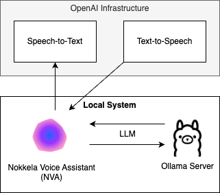

* MacOS
* * Requirement:
* * * Apple M3
* * * 24 GB RAM
* * Recommendation:
* * * Apple M4
* * * 32 GB RAM

```
ollama run cogito:8b
```

## (Local) Ollama: "Cogito-3B" Model Support

* MacOS
* * Requirement:
* * * Apple M3
* * * 16 GB RAM

```
ollama run cogito:3b
```

## (Remote) (X)TTS "Text-to-Speech" (Selfhosted)

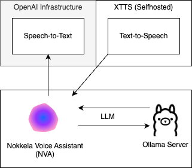

* Server with NVIDIA GPU | VM with (v)GPU Passthrough
* * Requirement:
* * * NVIDIA T4 (16 GB)
* * Recommendation:
* * * NVIDIA L4 (24 GB)

### NVA: Docker ENVs

```shell
docker run \
       -d \
       -p 20001:20001 \
       -e OPENAI_KEY="YOUR-API-KEY" \
       -e OLLAMA_CHAT_URL="http://YOUR-SERVER-IP:11434/v1/chat/completions" \
       -e OPENAI_TTS_URL="Service 1 URL or Service 2 URL or Service 3 URL" \
       -e TTS_HD="YES" \
       -e TTS_VOICE="shimmer" \
       -v /data/nva:/app/data \
       nokkela-voice-assistant
```

## TTS Service 1: openedai-speech

* https://github.com/nokkela-ai/NPRF_4_openedai-speech

### Server: Prepare

```shell
git clone https://github.com/nokkela-ai/NPRF_4_openedai-speech
cp sample.env speech.env
```

### Server: Config

```shell
TTS_HOME=voices
HF_HOME=voices
#PRELOAD_MODEL=xtts
PRELOAD_MODEL=xtts_v2.0.2
#EXTRA_ARGS=--log-level DEBUG --unload-timer 300
#USE_ROCM=1
```

### Server: Service

```shell
docker compose up
```

### NVA: Docker ENV

```shell
-e OPENAI_TTS_URL="http://YOUR-SERVER-IP:8000/v1/audio/speech" \
```

### Configurable Voices: (NVA Docker ENV: TTS_VOICE)

* alloy
* echo
* fable (we recommend)
* onyx
* nova
* shimmer

### More Voices (requires manual download and config adjustments)

```shell
root@9fff78efd3d2:/app/voices# grep "key" /app/voices/voices.json
```

### Example: for a german onnx bundle

* https://www.thorsten-voice.de/
* https://huggingface.co/csukuangfj/vits-piper-de_DE-thorsten-high/tree/main

```shell
apt-get update; apt-get install git-lfs
mkdir -p /opt/tts_onnx
cd /opt/tts_onnx
git clone https://huggingface.co/csukuangfj/vits-piper-de_DE-thorsten-high

docker cp /opt/tts_onnx/vits-piper-de_DE-thorsten-high/de_DE-thorsten-high.onnx.json CONTAINERID:/app/voices
docker cp /opt/tts_onnx/vits-piper-de_DE-thorsten-high/de_DE-thorsten-high.onnx CONTAINERID:/app/voices

docker exec CONTAINERID bash -c "apt-get update && apt-get install -y ed"
```

```shell
docker exec CONTAINERID bash -c "ed -s /app/config/voice_to_speaker.yaml << 'EOF'
/speaker: 163/
a
  thorsten:
    model: voices/de_DE-thorsten-high.onnx
    speaker: # default speaker
.
w
EOF"
```

```shell
docker stop CONTAINERID
docker start CONTAINERID
```

### "xtts" Limitations (Docker Logs)

```shell
... ... ...
server-1  | INFO:     XXX.XXX.XXX.XXX:53808 - "POST /v1/audio/speech HTTP/1.1" 200 OK
The text length exceeds the character limit of 253 for language 'de', this might cause truncated audio.
... ... ...
```

### Voices / Languages supported

English, Spanish, French, German, Italian, Portuguese, Polish, Turkish, Russian, Dutch, Czech, Arabic, Chinese (Simplified), Hungarian, Korean, Japanese, Hindi

## TTS Service 2: speaches.ai

* https://speaches.ai/

### Server: Service

```shell
docker run \
       --detach \
       --publish 8000:8000 \
       --name speaches \
       --volume /opt/hf-hub-cache:/home/ubuntu/.cache/huggingface/hub \
       --gpus=all \
       -e WHISPER__TTL=-1 \
       ghcr.io/speaches-ai/speaches:latest-cuda
```

### Python (Dummy) Container for downloading the (TTS) model

* https://speaches.ai/installation/
* https://speaches.ai/usage/text-to-speech/

```shell
docker run -it python:3.12 bash

apt-get update
apt-get install -y jq
pip install uv

git clone https://github.com/speaches-ai/speaches.git
cd speaches 
uv venv
source .venv/bin/activate
uv sync --all-extras

export SPEACHES_BASE_URL="http://YOUR-SERVER-IP:8000"

uvx speaches-cli registry ls --task text-to-speech | jq '.data[] | .id' > DATA_TTS
grep "Kokoro" DATA_TTS
uvx speaches-cli model download speaches-ai/Kokoro-82M-v1.0-ONNX
uvx speaches-cli model ls --task text-to-speech | jq '.data | map(select(.id == "speaches-ai/Kokoro-82M-v1.0-ONNX"))'

exit
``` 

### NVA: Docker ENV

```shell
-e OPENAI_TTS_URL="http://YOUR-SERVER-IP:8000/v1/audio/speech" \
```

### Voices / Languages supported

American English, British English, Japanese, Mandarin Chinese, Spanish, French, Hindi, Italian, Brazilian Portuguese

## TTS Service 3: openai-edge-tts

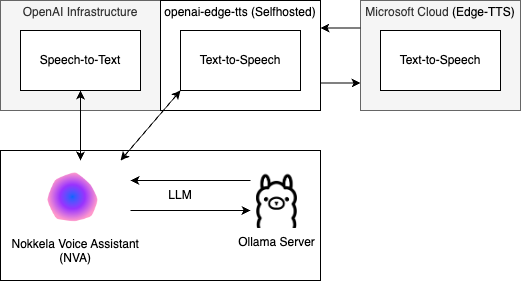

* https://github.com/nokkela-ai/NPRF_7_openai-edge-tts

### Server: Prepare

```shell
git clone https://github.com/nokkela-ai/NPRF_7_openai-edge-tts
cd openai-edge-tts

cp .env.example .env
```

### Server: Config

```shell
API_KEY=your_api_key_here
PORT=5050

DEFAULT_VOICE=shimmer
DEFAULT_RESPONSE_FORMAT=mp3
DEFAULT_SPEED=1.0

DEFAULT_LANGUAGE=en-US

REQUIRE_API_KEY=False

REMOVE_FILTER=False

EXPAND_API=True
```

### Server: Service

```shell
docker compose up --build
```

### NVA: Docker ENV

```shell
-e OPENAI_TTS_URL="http://YOUR-SERVER-IP:5050/v1/audio/speech" \
```

### Voices / Languages supported

English, Spanish, Arabic, Korean, Thai, Vietnamese, Japanese, French, Portuguese, Indonesian, Hebrew, Italian, Dutch, Malay, Norwegian, Swedish, Greek, German, Afrikaans, Amharic, Azerbaijani, Bulgarian, Bengali, Bosnian, Catalan, Czech, Welsh, Danish, Estonian, Persian, Finnish, Irish, Galician, Gujarati, Hindi, Croatian, Hungarian, Icelandic, Javanese, Georgian, Kazakh, Khmer, Kannada, Lao, Lithuanian, Latvian, Macedonian, Malayalam, Mongolian, Marathi, Maltese, Burmese, Nepali, Polish, Pashto, Romanian, Russian, Sinhala, Slovak, Slovenian, Somali, Albanian, Serbian, Sundanese, Swahili, Tamil, Telugu, Turkish, Ukrainian, Urdu, Uzbek, Mandarin, Zulu

## Full Selfhosted Setup

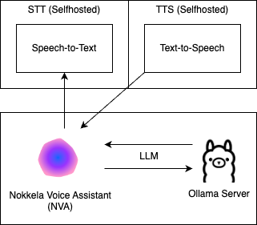

### Selfhosted: STT (Speech-to-Text) - (Systran/faster-whisper-large-v3)

* https://github.com/NokkelaAI/nokkela-voice-assistant?tab=readme-ov-file#remote-whisperstt-speech-to-text-selfhosted

### Selfhosted: LLM (Large Language Model)

* https://github.com/NokkelaAI/nokkela-voice-assistant?tab=readme-ov-file#remote-ollama-docker-service-selfhosted

### Selfhosted: TTS (Text-to-Speech)

* https://github.com/NokkelaAI/nokkela-voice-assistant?tab=readme-ov-file#remote-xtts-text-to-speech-selfhosted

### NVA: Docker ENVs (STT + LLM + TTS with openedai-speech - XTTS + WEB_AUTH)

```shell
docker run \
       -d \
       -p 20001:20001 \
       -e OPENAI_TRANSCRIBE_URL="http://YOUR-SERVER-IP:8000/v1/audio/transcriptions" \
       -e OLLAMA_CHAT_URL="http://YOUR-SERVER-IP:11434/v1/chat/completions" \
       -e OPENAI_TTS_URL="http://YOUR-SERVER-IP:8000/v1/audio/speech" \
       -e TTS_HD="YES" \
       -e TTS_VOICE="fable" \
       -e WEB_AUTH_USER="nva" \
       -e WEB_AUTH_PW="secret" \
       -v /data/nva:/app/data \
       nokkela-voice-assistant
```

### NVA: Docker ENVs (STT + LLM + TTS with openedai-speech - Custom ONNX + WEB_AUTH)

```shell
docker run \
       -d \
       -p 20001:20001 \
       -e OPENAI_TRANSCRIBE_URL="http://YOUR-SERVER-IP:8000/v1/audio/transcriptions" \
       -e OLLAMA_CHAT_URL="http://YOUR-SERVER-IP:11434/v1/chat/completions" \
       -e OPENAI_TTS_URL="http://YOUR-SERVER-IP:8000/v1/audio/speech" \
       -e TTS_HD="NO" \
       -e TTS_VOICE="thorsten" \
       -e WEB_AUTH_USER="nva" \
       -e WEB_AUTH_PW="secret" \
       -v /data/nva:/app/data \
       nokkela-voice-assistant
```

# Donation

[Buy Me a Coffee](https://www.buymeacoffee.com/nokkela.ai)

## LICENSE

[GPLv3](https://opensource.org/license/gpl-3-0/)

